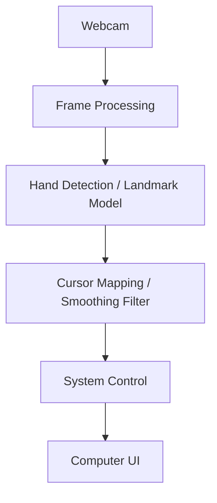
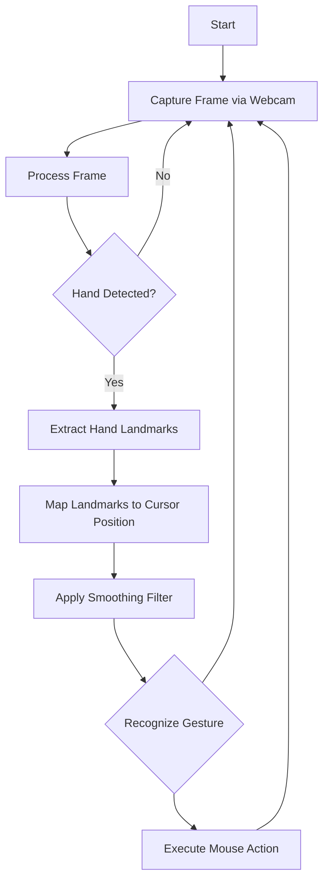
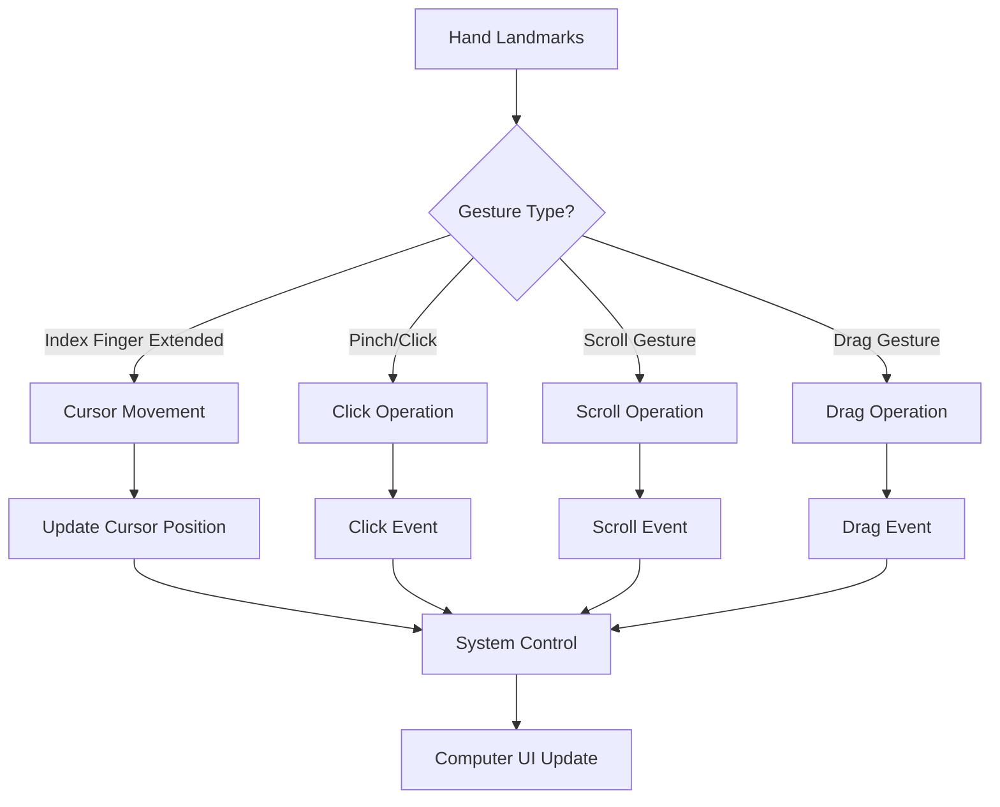
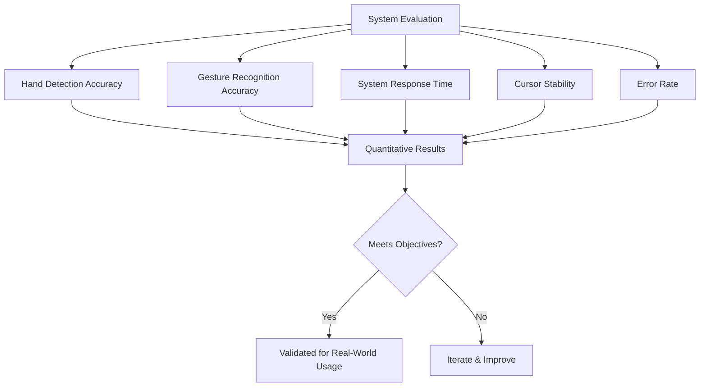
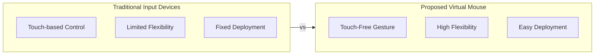
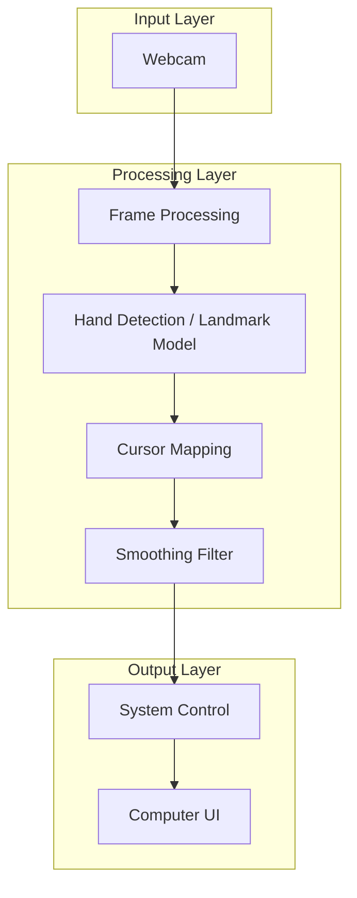
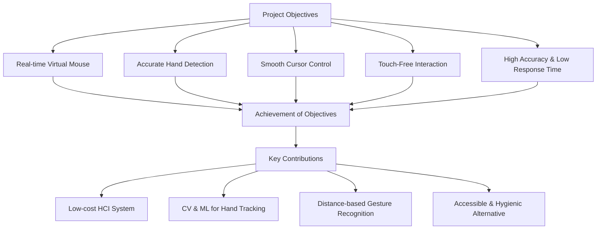
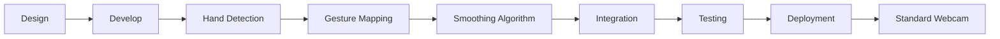

# Gesture Based Virtual Mouse System — Flowchart (from Batch - 7 rw- 04.pptx)

## Project Info
- **Title:** A Gesture Based Virtual Mouse System
- **Batch:** 17
- **Guide:** Mr. T. Krishna Murthy

---

## 1. Complete Implementation — System Pipeline

## 2. Core Processing Flow

## 3. Gesture Recognition & Control Flow

## 4. Evaluation Metrics Flow

## 5. Comparison: Traditional vs Proposed System

## 6. Overall System Architecture

## 7. Key Achievements Flow

## 8. Implementation to Deployment Flow

---

## Quick Reference: System Components

| Component | Purpose |
|-----------|---------|
| Webcam | Capture real-time video input |
| Frame Processing | Preprocess video frames |
| Hand Detection | Detect and track hand in frame |
| Landmark Model | Extract 21 hand landmark points |
| Cursor Mapping | Map landmarks to screen coordinates |
| Smoothing Filter | Stabilize cursor movement |
| System Control | Execute mouse events (click, scroll, drag) |
| Computer UI | Display and interact with applications |
